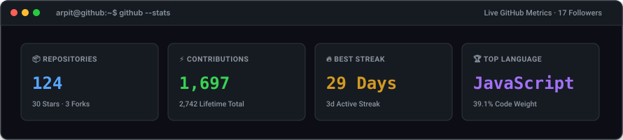

<div align="center">

<!-- Terminal Hero Banner -->
<a href="https://arpitdev.vercel.app/">
  
</a>

<br/>

<!-- Real GitHub Contribution Calendar Heatmap -->
<p align="left">
  
  <b>&nbsp;CONTRIBUTION ACTIVITY</b>
</p>



<br/><br/>

<!-- Whoami & System Specifications (ASCII Portrait + Neofetch Info Card) -->
<table border="0" cellpadding="0" cellspacing="0" width="100%">
  <tr>
    <td width="50%" align="center" valign="top">
      
    </td>
    <td width="50%" align="center" valign="top">
      
    </td>
  </tr>
</table>

<br/>

<!-- Real GitHub Language Distribution -->
<p align="left">
  <b>&nbsp;REAL REPOSITORY LANGUAGE DISTRIBUTION</b>
</p>



<br/><br/>

<!-- Real GitHub Statistics Dashboard -->
<p align="left">
  <b>&nbsp;AUTHENTIC GITHUB ACTIVITY &amp; METRICS</b>
</p>



</div>

<br/>

---

### 💻 `$ ls ~/tech-stack`

<table width="100%">
  <tr>
    <td width="25%" valign="top">
      <h4>⚡ Frontend</h4>
      <ul>
        <li><b>React.js</b></li>
        <li><b>Next.js</b></li>
        <li><b>TypeScript</b></li>
        <li><b>JavaScript</b> (ES6+)</li>
        <li><b>Tailwind CSS</b></li>
        <li>Redux / Zustand</li>
        <li>HTML5 &amp; CSS3</li>
      </ul>
    </td>
    <td width="25%" valign="top">
      <h4>🛠️ Backend</h4>
      <ul>
        <li><b>Node.js</b></li>
        <li><b>Express.js</b></li>
        <li><b>NestJS</b></li>
        <li><b>Python</b></li>
        <li><b>FastAPI</b></li>
        <li>REST &amp; Socket.io</li>
        <li>Microservices</li>
      </ul>
    </td>
    <td width="25%" valign="top">
      <h4>🗄️ Databases</h4>
      <ul>
        <li><b>PostgreSQL</b></li>
        <li><b>MongoDB</b></li>
        <li><b>MySQL</b></li>
        <li><b>Firebase</b></li>
        <li>Prisma / Mongoose</li>
        <li>Redis (Caching)</li>
      </ul>
    </td>
    <td width="25%" valign="top">
      <h4>🤖 AI &amp; Tooling</h4>
      <ul>
        <li><b>Generative AI</b></li>
        <li><b>Gemini API</b></li>
        <li>Docker</li>
        <li>Git &amp; GitHub</li>
        <li>Linux / CLI</li>
        <li>Figma</li>
      </ul>
    </td>
  </tr>
</table>

<br/>

---

### 🚀 `$ ls -la ~/featured-projects`

<table>
  <tr>
    <td width="50%" valign="top">
      <h4>🤖 <a href="https://github.com/Arpit10110/AuraAi">AuraAI</a></h4>
      <p>Intelligent multimodal AI assistant platform integrating Gemini API for dynamic reasoning, content synthesis, and real-time user prompts.</p>
      <p><code>React</code> · <code>Node.js</code> · <code>Express</code> · <code>Generative AI</code> · <code>Gemini API</code></p>
      <p><a href="https://github.com/Arpit10110/AuraAi"><b>View Repository →</b></a></p>
    </td>
    <td width="50%" valign="top">
      <h4>🏥 <a href="https://github.com/Arpit10110/HealthBridge-frontend">HealthBridge</a></h4>
      <p>Full-stack healthcare consultation and medical records platform connecting patients with practitioners through real-time appointments.</p>
      <p><code>React.js</code> · <code>Node.js</code> · <code>Express.js</code> · <code>MongoDB</code> · <code>Tailwind</code></p>
      <p><a href="https://github.com/Arpit10110/HealthBridge-frontend"><b>View Frontend →</b></a> · <a href="https://github.com/Arpit10110/HealthBridge-Backend"><b>Backend →</b></a></p>
    </td>
  </tr>
  <tr>
    <td width="50%" valign="top">
      <h4>💼 <a href="https://github.com/Arpit10110/JobHawk-fronted">JobHawk</a></h4>
      <p>Modern job search and career tracking portal featuring real-time opportunities, custom filtering, and dynamic application tracking.</p>
      <p><code>Next.js</code> · <code>TypeScript</code> · <code>Tailwind CSS</code> · <code>REST API</code></p>
      <p><a href="https://github.com/Arpit10110/JobHawk-fronted"><b>View Repository →</b></a></p>
    </td>
    <td width="50%" valign="top">
      <h4>⚡ <a href="https://github.com/Arpit10110/Arbyte">Arbyte CLI</a></h4>
      <p>Published Node.js CLI utility package designed for rapid development scaffolding, automation commands, and developer toolkits.</p>
      <p><code>Node.js</code> · <code>JavaScript</code> · <code>npm package</code> · <code>CLI</code></p>
      <p><a href="https://github.com/Arpit10110/Arbyte"><b>View Repository →</b></a></p>
    </td>
  </tr>
  <tr>
    <td width="50%" valign="top">
      <h4>🎓 <a href="https://github.com/Arpit10110/ScolarMart">ScolarMart</a></h4>
      <p>Interactive student marketplace enabling academic book exchanges, campus product trading, and peer-to-peer resource sharing.</p>
      <p><code>React.js</code> · <code>Node.js</code> · <code>Express.js</code> · <code>MongoDB</code></p>
      <p><a href="https://github.com/Arpit10110/ScolarMart"><b>View Repository →</b></a></p>
    </td>
    <td width="50%" valign="top">
      <h4>🎨 <a href="https://github.com/Arpit10110/Ochi">Ochi Showcase</a></h4>
      <p>Award-winning interactive presentation web experience demonstrating modern GSAP micro-animations, custom cursor physics, and sleek UI.</p>
      <p><code>JavaScript</code> · <code>CSS3</code> · <code>GSAP</code> · <code>Interactive Design</code></p>
      <p><a href="https://github.com/Arpit10110/Ochi"><b>View Repository →</b></a></p>
    </td>
  </tr>
</table>

<br/>

---

### 📡 `$ cat ~/current-focus.txt`

```bash
$ cat ~/current-focus.txt
```

- 🚀 **Currently Building**:
  - **Wapix** — WhatsApp API platform, automated messaging & business integrations.
  - **Generative AI Developer Tools** — Intelligent agents, prompt pipelines, and developer accelerators.
  - **Full-Stack SaaS Applications** — Production-grade architectures using Next.js, NestJS, and PostgreSQL.

- 🧠 **Currently Learning & Exploring**:
  - Python ecosystem & **FastAPI** high-performance asynchronous backends.
  - Autonomous AI Agents & Function Calling workflows.
  - Distributed Systems Architecture & Microservices.

<br/>

---

### 🌐 `$ ./connect.sh`

```bash
$ ./connect.sh --all
```

<div align="center">

| Platform | Link | Action |
|:---|:---|:---|
| **Portfolio** | `arpitdev.vercel.app` | [**Visit Portfolio**](https://arpitdev.vercel.app/) |
| **LinkedIn** | `linkedin.com/in/arpit-agrahari-54aa192a1` | [**Connect on LinkedIn**](https://linkedin.com/in/arpit-agrahari-54aa192a1) |
| **GitHub** | `github.com/Arpit10110` | [**Follow @Arpit10110**](https://github.com/Arpit10110) |
| **LeetCode** | `leetcode.com/arpit_agrahari` | [**View Solutions**](https://www.leetcode.com/arpit_agrahari) |
| **GeeksforGeeks** | `geeksforgeeks.org/user/arpit_agrahari10100` | [**View DSA Score (1000+)**](https://auth.geeksforgeeks.org/user/arpit_agrahari10100) |
| **Discord** | `discord.gg/arpitagrahari` | [**Join Discord**](https://discord.gg/arpitagrahari) |
| **Instagram** | `instagram.com/anonymous_.pdf` | [**Follow Instagram**](https://instagram.com/anonymous_.pdf) |
| **Resume** | Google Drive Document | [**View Resume**](https://drive.google.com/file/d/1mP7xFLobYVuCHrJGZMg8egGWfkdRkilr/view?usp=sharing) |
| **Email** | Direct Mail | [**arpitkumaragrahari21@gmail.com**](mailto:arpitkumaragrahari21@gmail.com) |

</div>

<br/>

---

<div align="center">

```bash
arpit@github:~$ echo "Built with code, caffeine & questionable sleep schedules. Thanks for visiting 👋"
arpit@github:~$ exit
```

<p align="center">
  
</p>

<sub>This profile automatically syncs using GitHub Actions and custom Python SVG generators. See <a href="./PROFILE_SETUP.md">PROFILE_SETUP.md</a> for details.</sub>

</div>
